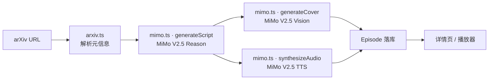

# PaperCast Architecture

本文档描述 PaperCast 的端到端流水线、MiMo V2.5 三种能力的具体调用方式，以及 token 消耗预估 —— 这是我们申请 100T 计划的容量依据。

---

## 1. 端到端流水线



整个生成过程被设计成 **4 步流水线**，前端通过 SSE 流式展示每一步状态：

| 步骤 | 名称 | 输入 | 输出 | 模型 |
| --- | --- | --- | --- | --- |
| ① | 解析论文 | arXiv URL | `Paper { title, abstract, authors }` | —（HTML 解析） |
| ② | 生成脚本 | Paper | `Segment[]`（双人对话） | `mimo-v2.5-reason` |
| ③ | 生成封面 | title + abstract → 视觉 prompt | PNG URL | `mimo-v2.5-vision` |
| ④ | 双人 TTS | Segment[] | MP3 URL | `mimo-v2.5-tts` |

---

## 2. MiMo 调用细节

### 2.1 推理 · 生成对话脚本

**人设**：
- **主播 Lin**（女声，温度 0.6）：知识广、提问视角好奇
- **嘉宾 Wei**（男声，温度 0.8）：领域专家、习惯用类比解释

**Prompt 模板**（见 `lib/prompts.ts`）：

```
你是一档 AI 论文播客的脚本编辑。请基于下方论文，写一段 8-12 分钟、
两位主播自然交谈的播客脚本。

主播 Lin：好奇、提问代入读者；嘉宾 Wei：领域专家、用类比解释。

要求：
- 段落用 JSON 数组返回，每段 { speaker, text }
- 不出现 markdown，不出现引号、星号、emoji
- 涵盖：研究问题 → 核心方法 → 实验亮点 → 局限与展望
- 全程中文，专业术语首次出现给出口语化解释

论文标题：{title}
摘要：{abstract}
关键章节摘录：{excerpts}
```

**单集 token 估算**：
- 输入：论文摘要 + 章节摘录 + system prompt ≈ **3,000 tokens**
- 输出：双人对话脚本 8-12 分钟 ≈ **5,000 tokens**
- 单集合计 ≈ **8,000 推理 tokens**

### 2.2 多模态 · 生成封面

**Prompt 策略**：从论文标题与摘要中抽取核心概念词 → 通过 Reason 模型生成 80 字以内的视觉描述 → 调用 Vision 文生图。

```
风格关键词：极简几何、莫兰迪色调、出版物海报、科技感、留白
内容关键词：{从论文中抽取的 3-5 个核心实体}
比例：1:1，1024×1024
```

**单集 token 估算**：
- 视觉 prompt 生成（Reason）：~500 tokens
- 文生图（Vision）：1 张 1024×1024
- 单集合计 ≈ **500 推理 tokens + 1 张图**

### 2.3 语音合成 · 双人 TTS

**音色映射**：
- `host_voice = "mimo_lin_zh_warm"` —— 女声、温暖、播客感
- `guest_voice = "mimo_wei_zh_natural"` —— 男声、自然、专业

**调用方式**：每段 `Segment` 单独合成，最后用 ffmpeg 串接（生产环境）；`mock` 模式下跳过合成，直接返回占位音频路径。

**单集 token 估算**（按 MiMo TTS 1 token ≈ 1 中文字计）：
- 8-12 分钟脚本 ≈ 2,500 中文字 ≈ **2,500 TTS tokens**

---

## 3. 单集总 token 消耗

| 类型 | 用量 |
| --- | --- |
| Reason | ≈ 8,500 tokens |
| Vision | 1 张图（按 MiMo 计费规则折算） |
| TTS | ≈ 2,500 tokens |

**单集合计 ≈ 11,000 文本 token + 1 张图**。

---

## 4. 容量目标与 Orbit 权益预估

PaperCast 短期目标是周更 5-7 集 + 用户自助生成。**6 个月内目标产出**：

| 维度 | 目标 |
| --- | --- |
| 编辑部周更播客 | 6 集/周 × 26 周 = **156 集** |
| 用户自助生成（保守估计） | 1,000 用户 × 月均 5 集 × 6 月 = **30,000 集** |
| 合计 | **30,156 集** |

按单集 11k token 折算：

> **30,156 × 11,000 ≈ 3.3 亿 tokens（不含图像）**

这是一个真实可消化、且能产出对应数量公开内容的容量目标，正好对应 Orbit 计划的"高质量 AI 创造者"画像。

---

## 5. 数据流与缓存

- **生成结果落地**：每集 Episode 在 MVP 阶段直接序列化到 `lib/data/episodes.ts`；生产阶段切换到 SQLite + S3。
- **prompt 缓存**：相同论文 + 相同风格触发缓存命中，**不重复消耗 token**（防止用户反复触发同一篇论文导致权益浪费）。
- **失败重试**：每一步独立可重试，已生成的中间产物（脚本、封面、音频）在重试时跳过。

---

## 6. 安全与合规

- arXiv 论文元信息均为公开数据
- 用户上传 PDF 在 MVP 阶段不开放（路线图 Phase 3）
- 所有 MiMo API key 从 server-side env 读取，前端永远不接触
- 生成的播客明确标注「由 AI 主播录制，内容仅供学习参考」
