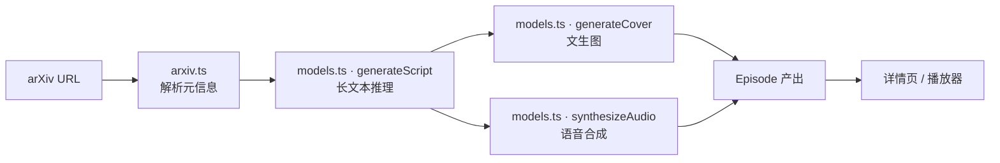

# PaperStack Architecture

本文档描述 PaperCast 的端到端流水线与各模块设计。

---

## 1. 端到端流水线



整个生成过程被设计成 **4 步流水线**：

| 步骤 | 名称 | 输入 | 输出 |
| --- | --- | --- | --- |
| ① | 解析论文 | arXiv URL | Paper 元信息（标题、摘要、作者） |
| ② | 生成脚本 | Paper | Segment[]（双人对话） |
| ③ | 生成封面 | title + abstract → 视觉 prompt | 封面图 URL |
| ④ | 双人 TTS | Segment[] | 音频 URL |

---

## 2. 模型调用细节

### 2.1 推理 · 生成对话脚本

**人设**：
- **主播 Lin**（女声，温度 0.6）：知识广、提问视角好奇
- **嘉宾 Wei**（男声，温度 0.8）：领域专家、习惯用类比解释

**Prompt 设计**（见 `lib/prompts.ts`）：

```
你是一档 AI 论文播客的脚本编辑。请基于下方论文，写一段 8-12 分钟、
两位主播自然交谈的播客脚本。

要求：
- 段落用 JSON 数组返回，每段 { speaker, text }
- 不出现 markdown、引号、星号、emoji
- 涵盖：研究问题 → 核心方法 → 实验亮点 → 局限与展望
- 全程中文，专业术语首次出现给出口语化解释
```

**单集 token 估算**：
- 输入：论文摘要 + 章节摘录 + system prompt ≈ **3,000 tokens**
- 输出：双人对话脚本 8-12 分钟 ≈ **5,000 tokens**
- 单集合计 ≈ **8,000 推理 tokens**

### 2.2 文生图 · 生成封面

从论文标题与摘要中抽取核心概念词，生成统一视觉风格的封面。

**风格关键词**：极简几何、莫兰迪色调、出版物海报、科技感、留白

**单集 token 估算**：视觉 prompt 生成 ≈ 500 tokens + 1 张 1024×1024 图

### 2.3 语音合成 · 双人 TTS

每段 Segment 单独合成，生产环境用 ffmpeg 串接；mock 模式跳过合成，直接返回占位音频路径。

**单集估算**：8-12 分钟脚本 ≈ 2,500 中文字 ≈ **2,500 TTS tokens**

---

## 3. 单集总消耗

| 类型 | 用量 |
| --- | --- |
| 推理 | ≈ 8,500 tokens |
| 文生图 | 1 张图 |
| TTS | ≈ 2,500 tokens |

**单集合计 ≈ 11,000 文本 token + 1 张图**。

---

## 4. 数据流与缓存

- **生成结果**：MVP 阶段序列化到 `lib/data/episodes.ts`，生产阶段切换到 SQLite + S3
- **prompt 缓存**：相同论文 + 相同风格触发缓存命中，不重复消耗 token
- **失败重试**：每一步独立可重试，已生成的中间产物在重试时跳过

---

## 5. 安全与合规

- arXiv 论文元信息均为公开数据
- 用户上传 PDF 在 MVP 阶段不开放
- API key 从 server-side env 读取，前端不接触
- 生成的播客标注「由 AI 主播录制，内容仅供学习参考」
